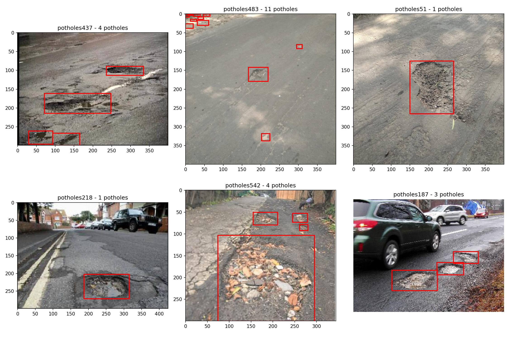

# Project 4: Pothole Detection System
02516 Introduction to Deep Learning in Computer Vision - DTU

Three part project to build a pothole detection system using object proposals and a CNN classifier.

## Setup
```bash
conda env create -f environment.yml
conda activate IDLCV
```

Dataset: `/dtu/datasets1/02516/potholes/`

---

## Part 1: Object Proposals

### Task 1: Data Familiarization
Loaded the dataset and visualized samples with ground truth bounding boxes. Split into 498 train, 99 val, 68 test.



### Task 2: Proposal Extraction
Used selective search with scale=500, sigma=0.9, min_size=20. Extracted proposals for all splits (~300 proposals per image on avg).

Results saved as pickle files (Python's serialization format for saving objects):
- `results/part_1/train_proposals.pkl` - 498 images
- `results/part_1/val_proposals.pkl` - 99 images  
- `results/part_1/test_proposals.pkl` - 68 images

Each pickle file contains a dict mapping filename → proposals + image dimensions.

### Task 3: Evaluation
TODO

### Task 4: Labeling
TODO

---

## Part 2: CNN Classifier

### Task 1: Build CNN
TODO

### Task 2: Dataloader with Balanced Sampling
TODO

### Task 3: Training
TODO

### Task 4: Evaluation
TODO

---

## Part 3: Testing & Evaluation

### Task 1: Apply CNN to Test Images
TODO

### Task 2: NMS
TODO

### Task 3: Average Precision
TODO