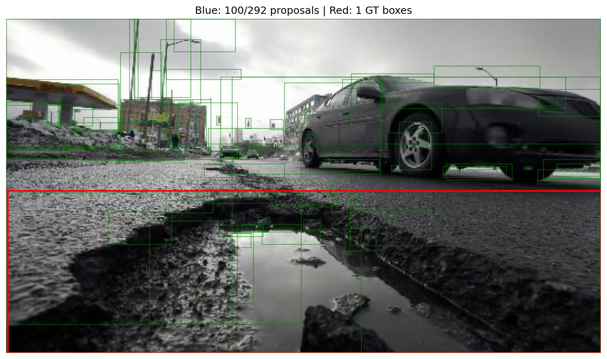
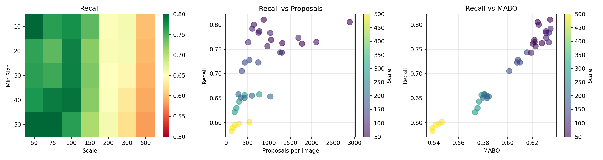

# Project 4: Pothole Detection System
02516 Introduction to Deep Learning in Computer Vision - DTU

Three part project to build a pothole detection system using object proposals and a CNN classifier.

## Setup
```bash
conda env create -f environment.yml
conda activate IDLCV
```

Dataset: `/dtu/datasets1/02516/potholes/`

---

## Part 1: Object Proposals

### Task 1: Data Familiarization
Loaded the dataset and visualized samples with ground truth bounding boxes. Split into 498 train, 99 val, 68 test.


### Task 2: Proposal Extraction
Used selective search with scale=500, sigma=0.9, min_size=20. Extracted proposals for all splits (~300 proposals per image on avg).

Results saved as pickle files (Python's serialization format for saving objects):
- `results/part_1/train_proposals.pkl` - 498 images
- `results/part_1/val_proposals.pkl` - 99 images  
- `results/part_1/test_proposals.pkl` - 68 images

Each pickle file contains a dict mapping filename → proposals + image dimensions.

### Task 3: Evaluation
Evaluated proposals using recall and MABO metrics on train set.

**Baseline results (scale=500, sigma=0.9, min_size=20)**
- Mean recall @IoU=0.5: **60.1%**
- Mean MABO: **54.5%**
- Proposals per image: ~306



*Green: proposals, Red: ground truth boxes*

---

**Optional: Parameter optimization**

Baseline recall&mabo seemed low, so tested if different parameters could improve it.

*Manual testing (`try_params.py`):*
- scale=500, min_size=20: 59.8% recall, 54.4% MABO, 302 proposals
- scale=300, min_size=30: 64.3% recall, 57.7% MABO, 312 proposals  
- scale=100, min_size=40: **79.2% recall**, 63.5% MABO, 614 proposals

Smaller scale and larger min_size improves recall&mabo. Decided to run a systematic grid search.

*Systematic optimization (`optimize_params.py`):*
- Grid search: 35 combinations (scale: 50-500, min_size: 10-50, sigma fixed at 0.9)
- Best config: **scale=50, sigma=0.9, min_size=50**
- Results: **81.0% recall**, **63.5% MABO**, ~883 proposals/image



Big improvement over baseline, re-extracted all splits with optimized parameters. Will use `optimized_*_proposals.pkl` for labeling.

### Task 4: Labeling
Labeled all proposals as positive (IoU ≥ 0.5) or negative (IoU < 0.5) for CNN training.

Results:
- Train: 5,930 positive (1.3%), 435,549 negative → ratio 1:73
- Val: 1,332 positive (1.5%), 90,044 negative → ratio 1:68
- Test: 772 positive (1.3%), 60,146 negative → ratio 1:78

Severe class imbalance, we probably wont be using all the negative data in part 2.


*Green=ground truth, Blue=positive proposals, Red=negative proposals*

---

## Part 2: CNN Classifier

### Task 1: Build CNN
Simple 4-layer CNN for binary classification (pothole vs background)

Architecture: Conv(32) → Conv(64) → Conv(128) → Conv(256) → FC(128) → FC(2)
- Input: 64×64 crops (avg proposals are small, can try larger in future when finetuning)
- 421,570 parameters
- Dropout 0.5 to reduce overfitting

### Task 2: Dataloader with Balanced Sampling
Build dataset that loads proposals from part 1 and crops them from images.

Train data: 441,479 proposals (5,930 pos, 435,549 neg)
Val data: 91,376 proposals (1,332 pos, 90,044 neg)

Class imbalance handling:
- Following lecture suggestion: 25% positives, 75 % negative per batch
- Training: use all 5930 positives, sample 3x negatives (different each epoch, acts like regularization)
- Validation: fixed subset (all 1332 positives + 3996 negatives) for comparable metrics

### Task 3: Training
Hyperparameters:
- Batch size: 64 (16 pos + 48 neg per batch)
- Optimizer: Adam, lr=0.001
- Epoch: 20

Results:
- Best val accuracy: **90.05%** at epoch 10
- Final train accuracy: **95.14%** (epoch 20)
- Model saved: `results/part_2/best_model.pth`

Model starts overfitting after epoch 10 - training accuracy keeps improving (75% → 95%) while validation peaks at 90% then degrades. Fixed validation subset makes this pattern clear. Could probably train for fewer epochs (10-12) or add more regularization.

### Task 4: Evaluation
Loaded best model and evaluated on full test set (60,918 proposals: 772 positive, 60,146 negative).

Results:

- Overall accuracy: 94.71% (Misleading due to class imbalance)
- Per-class metrics:
    - Background (class 0):
        - Precision: 99.56%, Recall: 95.06%, F1: 97.26%
    Pothole (class 1):
        - Precision: 14.91%, Recall: 67.49%, F1: 24.42%

Confusion Matrix:
```
              Predicted
           Bg      Pothole
Actual Bg  57172   2974
       Pot 251     521
```

Model catches 67% of potholes (decent recall) but has many false positives (low precision). This is expected, and will be solved by Non-Maximum Suppression (NMS) in part 3 of the project, by removing overlapping detections.

---

## Part 3: Object Detection Pipeline

### Task 1: Apply CNN to Test Images
Ran full detection pipeline on 68 test image:
1. Extract proposals using selective search
2. Classify each proposals with trained CNN
3. Keep detections where CNN predicts pothole (class 1, threshold=0.5)

Results:
- Total detections: 3,495
- Average per image: 51.4 detections

Many detections per image due to overlapping proposals and low precision from part 2, NMS should reduce this significantly.

### Task 2: NMS
Applied NMS with IoU threshold= 0.5 to remove overlapping detections

Algorithm:
1. Sort detections by confidence score (highest first)
2. Keep highest scoring box
3. Remove all boxes with IoU > 0.5 with kept box
4. Repeat until no boxes remain

Results:
- Before NMS: 3,495 detections (51.4 per image)
- After NMS: 168 detections (2.5 per image)
- Removed: 3,327 detections (95.2%)

NMS successfully reduced redundant overlapping boxes.

### Task 3: Average Precision
TODO